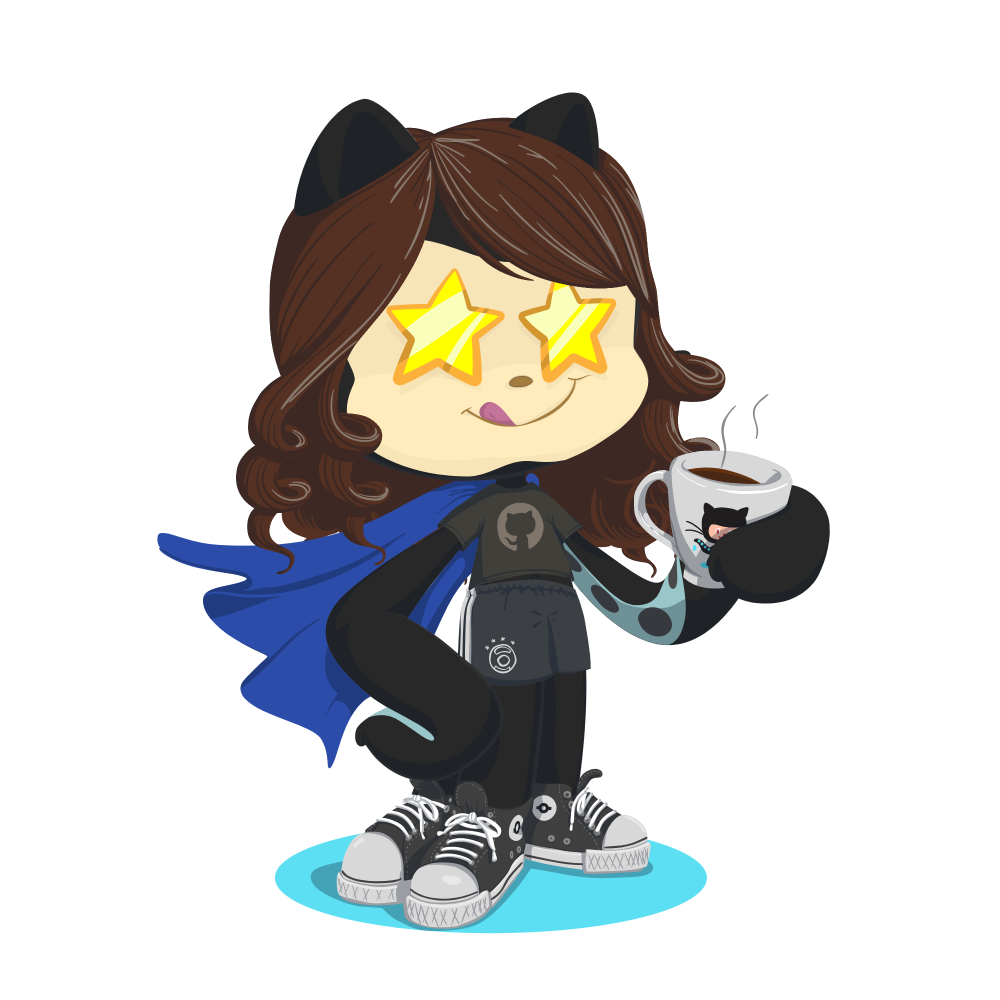

<!-- MEU README -- @laiscoutinho -->

 
  
    
   
   
   
  

 

<h2>✨ Sobre mim</h2>
<ul>
  <li>🎓 Técnica e Graduanda em Ciência da Computação pelo Instituto Federal do Ceará.</li>
  <li>💼 Desenvolvedora Frontend no Polo de Inovação.</li>
  <li>⚛️ Atuo com React, TypeScript e Angular na construção de interfaces modernas.</li>
  <li>🎯 Foco em engenharia de frontend, unindo arquitetura, performance e experiência do usuário.</li>
  <li>🤖 Interesse em Inteligência Artificial aplicada ao desenvolvimento de software.</li>
</ul>

<h2>🚀 O que você vai encontrar nos meus repositórios</h2>
<ul>
  <li>🏗️ <strong>Arquitetura escalável:</strong> Estruturação de projetos pensada para crescimento e manutenção.</li>
  <li>🧩 <strong>Componentização:</strong> Reuso, organização e separação clara de responsabilidades.</li>
  <li>🛠️ <strong>Boas práticas:</strong> Código limpo, padronizado e orientado a qualidade.</li>
  <li>🎨 <strong>UX & DX:</strong> Interfaces focadas na experiência do usuário e na produtividade de quem desenvolve.</li>
</ul>

<h3>💡 Projetos de impacto</h3>
<ul>
  <li><strong>HerTech Rise</strong> → Software com registro no INPI, voltado à inovação com impacto social.</li>
  <li><strong>Boamente</strong> → Sistema para apoio à saúde mental inteligente, aplicando tecnologia em problemas reais.</li>
</ul>

<h2>✨ Tecnologias e ferramentas</h2>
<h3>🤖 Tecnologias</h3>

  
  
  
    
  
  
  
  
  
  
  
  

<h3>🛠️ Ferramentas </h3>

  
  
  
  
  
  
  
  
  
  
  

<h2>⭐ Minhas métricas  </h2>

  
  

<strong>
  Cada projeto aqui é um registro da minha evolução técnica e da minha visão estratégica na construção de produtos digitais que resolvem problemas reais.
</strong>

  If you prefer, you can view this profile in English by clicking 
  <a href="./README-en.md">here</a>.

